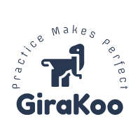

# GiraKoo开源项目

=== "中文"

    欢迎，这里是GiraKoo开源项目网站。  
    GiraKoo，是来自于Giraffe和Kangaroo的缩写组合。  
    
    我的微信备注名是✨Giraffe✨。  
    Honey的微信备注名是✨Kangaroo✨。  
    
    如果你对我的项目感兴趣，或者有任何想法。  
    欢迎通过E-Mail与我进行联系。  
    中文，英语均可。  

=== "English"

    Hi, This is GiraKoo‘s open source projects' HomePage.  
    GiraKoo is short for Giraffe and Kangaroo.  

    My remark name is ✨Giraffe✨ on WeChat.  
    My wife's remark name is ✨Kangaroo✨ on WeChat.  

    If you interest with my projects, or have any thoughts about them.  
    Please let me know. Email is recommended.  
    Chinese and English is available.  

## 简介 Introduction

### Logo

  
*From [http://yeelogo.com/](http://yeelogo.com/)*

## 目标 Targets

=== "中文"

    - 希望我的一些想法，能对其他开发者有帮助。
    - 希望我的问题能够被指出。
    - 通过练习，提高我的技术。

=== "English"

    - Some thoughts could be helpful to other developers.
    - My problems could be pointed out.
    - Improve my skills through practice.

## 联系方式 Contact

 [girakoo@163.com](mailto:girakoo@163.com)

## 捐助 Donate

如果我的项目对你有所帮助，或许可以能请我喝一杯。  
备注中可注明感兴趣的项目。  

  

## 项目一览 Projects

### 1. [GiString](./gi_string/)

基于C++实现的字符串类。

### 2. [GiJansson](./gi_jansson/)

封装Jansson API，使之可以更加安全，更加便捷的使用。

### 3. [GiLayout](./gi_layout/)

布局算法

### 4. [GiStrenchImage](./gi_strench_image/)

可拉伸的图片算法

### 5. [GiListener](./gi_listener/)

带扩展功能的监听者模式。

## 感谢

1. Visual Studio Code：功能强大的C/C++开发IDE
2. WPS：提供文档，绘图功能。
3. yeelogo.com：免费的Logo设计工具。
4. netlify：提供静态网站托管服务。
5. Github：提供代码托管服务。
6. Gitee：提供代码托管服务。（本地访问Github不稳定，通过Gitee进行中转）